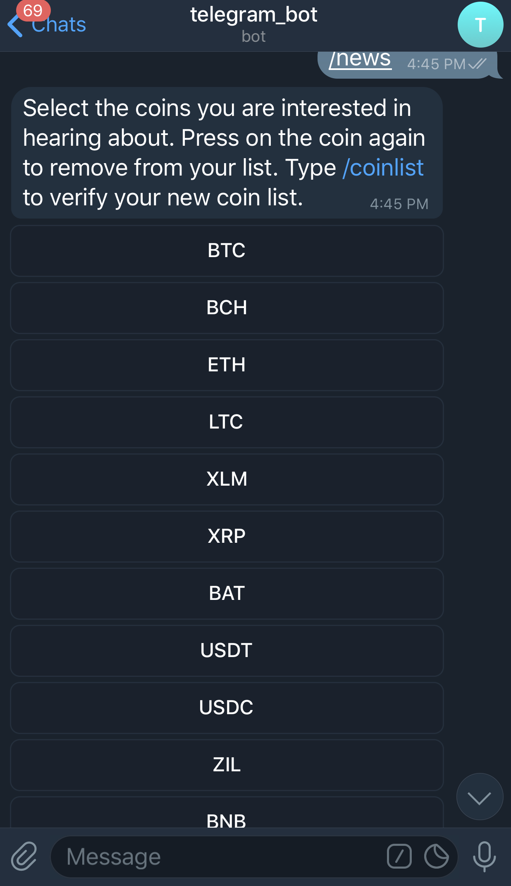
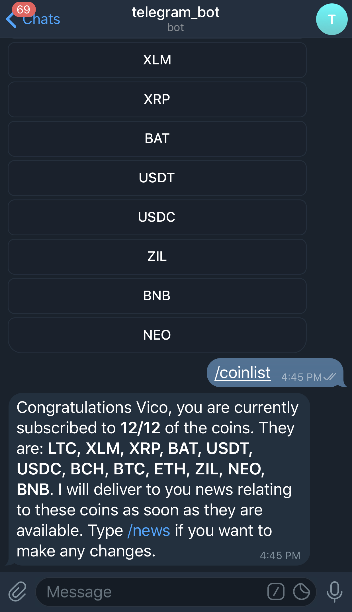

# news-telegram-bot-template

## Table of Contents

1. [Introduction](#1-introduction)

    * [Bot Simulation](#bot-simulation)

    * [Webhook Feature](#webhook-feature)

    * [News-Scrape-and-Send Feature](#news-scrape-and-send-feature)

2. [Setup Capistrano on Local Machine](#2-setup-capistrano-on-local-machine)

    * [Installing RVM and Ruby on Local Machine](#installing-rvm-and-ruby-on-local-machine)

    * [Setting up SSH Keys on Local Machine](#setting-up-ssh-keys-on-local-machine)

    * [Cloning Remote Repository to Local Machine](#cloning-remote-repository-to-local-machine)

3. [Setup Telegram Bot](#3-setup-telegram-bot)

    * [Adding Bot Token to Rails Credentials Key](#adding-bot-token-to-rails-credentials-key)

    * [Setup Webhook for Telegram Bot](#setup-webhook-for-telegram-bot)

4. [Deploy Changes to Remote Machine](#4-deploy-changes-to-remote-machine)
5. [Setup Supervisor for Bot News Dispatcher](#5-setup-supervisor-for-bot-news-dispatcher)
6. [Setup Telegram Bot Inline Command Suggestions](#6-setup-telegram-bot-inline-command-suggestions)
7. [References](#references)
8. [Contributing](#contributing)

## 1. Introduction

This project was created to help users who are interested in building their own telegram bot to send news to themselves. While it is not only limited to news, depending on the API link input under the [config file](https://github.com/Vicolee/news-telegram-bot/blob/master/config/credentials), I initially built this with the intention of scraping crypto news and sending to users via telegram on a regular time interval. Thus, kindly make the necessary adjustments should your API formatting be different.  If you want to see a simulation of the bot, proceed to [Bot Simulation](#bot-simulation).

Else, if you just want to see how to build the bot, skip straight to [Wehbook Feature](#webhook-feature) and [News-Scrape-and-Send Feature](#news-scrape-and-send-feature) to see the two main functionalities for this repository's telegram bot.

### Bot Simulation

In this section, I will be portraying a visual rundown of how the bot would look like.

First, users will have to setup their account with the bot. To do so, they will type `/start`


Next, type `/help` to view the list of available commands and their descriptions:


To select coins that you are interested in receiving news about, type `/news`. A list of [inline keyboard markup](https://core.telegram.org/bots/2-0-intro#callback-buttons) will appear, showing the coins that are available for the bot:



Press on the coin that you are interested in adding to your coin list. A inline keyboard reply will appear. Press the coin to add to coinlist. In the below case, I pressed on 'BTC' and an auto-reply is shown at the top of the screen:


Then, I pressed on 'BTC' again to remove 'BTC' from my coinlist:


After which, I added all the coins available to my coin list. Then, to check my current bag of coins, I typed `/coinlist`:



Realise that I have already selected 12/12 of the available coins.

What do I do now that I do not want the bot to keep spamming me?

To check status of your bot, type `/checkstatus`. By default, your bot should already be working on sending you messages. If you want to pause your bot, type `/pause`. Should you wish to resume your bot again, type `/resume`. Now, your bot will re-continue to send you news that you have added to your coin list.


### Webhook Feature

Firstly, it has a webhook that handles all incoming messages and replies the user with its respective response. See [webhooks_controller.rb](https://github.com/Vicolee/news-telegram-bot/blob/master/app/controllers/webhooks_controller.rb) for the script. [webhooks_controller.rb](https://github.com/Vicolee/news-telegram-bot/blob/master/app/controllers/webhooks_controller.rb) script goes on to call the script [bot_news_dispatcher.rb](https://github.com/Vicolee/news-telegram-bot/blob/master/app/models/bot_message_dispatcher.rb) which subsequently calls the respective command in the [bot_command](https://github.com/Vicolee/news-telegram-bot/blob/master/app/models/bot_command) folder.

### News-Scrape-and-Send Feature

Secondly, it has a [rake task](https://github.com/Vicolee/news-telegram-bot/blob/master/lib/tasks/dispatch_news.rake) that scrapes news from the API, as specified in [credentials](https://github.com/Vicolee/news-telegram-bot/blob/master/config/credentials), and sends to users news that they have indicated their interest in via telegram bot's [inline keyboard button feature](https://core.telegram.org/bots/2-0-intro#callback-buttons) which I've integrated into the script [bot_command/news.rb](https://github.com/Vicolee/news-telegram-bot/blob/master/app/models/bot_command/news.rb).

Running the command `rails server` will automatically run the webhook. However, you will need to manually run [rake dispatch_news[insert_time_interval(seconds)]](https://github.com/Vicolee/news-telegram-bot/blob/master/lib/tasks/dispatch_news.rake) to begin the second function of scraping news and sending news every specified interval.

Once you have managed to run the commands `rails server` and `rake dispatch_news[time_interval]` without any errors and have seen it working, you may proceed to see [steps 2-6](#2-setup-capistrano-on-local-machine) to see how to fully deploy your bot via a remote server without any downtime using Nginx and Capistrano.

## 2. Setup Capistrano on Local Machine

If you are deploying from scratch, follow this [guide](https://www.digitalocean.com/community/tutorials/deploying-a-rails-app-on-ubuntu-14-04-with-capistrano-nginx-and-puma).

Else, head over to [Installing RVM and Ruby on Local Machine](#installing-rvm-and-ruby-on-local-machine)if the remote server has already been configured and deployments have been made.

### Installing RVM and Ruby on Local Machine

First, import RVM GPG Key
```
$ gpg --keyserver hkp://keys.gnupg.net --recv-keys 409B6B1796C275462A1703113804BB82D39DC0E3
```
Then install RVM to manage our Rubies:
```
curl -sSL https://get.rvm.io | bash -s stable
```
Next, load the RVM script to start using it. Then, run the `requirements`command to automatically install required dependencies for RVM and Ruby:
```
$ source ~/.rvm/scripts/rvm
$ rvm requirements
```
Now, install the Ruby version that is the same as that used for the Rails App in the remote server:
```
$ rvm install 2.7.0
$ rvm use 2.7.0 --default
```

### Setting up SSH Keys on Local Machine

```
$ ssh-keygen -t rsa
```
Add your local SSH Key to your Remote Server's Authorized Keys file:
```
$ cat ~/.ssh/id_rsa.pub | ssh -p <insert your_port_num> <user>@<your_server_ip> 'cat >> ~/.ssh/authorized_keys'
```

### Cloning Remote Repository to Local Machine

```
$ git clone git@github.com:Vicolee/news-telegram-bot.git
$ cd news-telegram-bot
```

##### Note: Now, you should be able to make changes on your local machine and deploy to the remote server. See [Deploy Changes to Remote Machine](#4-deploy-changes-to-remote-machine) to do so.

## 3. Setup Telegram Bot

Note: Make sure that you have done [Step 1](#2-setup-capistrano-on-local-machine) before proceeding.

If you do not have a bot token yet, click [here](https://core.telegram.org/bots#6-botfather) to see how to setup one.

### Adding Bot Token to Rails Credentials Key

On your local machine terminal:
```
news-telegram-bot$ EDITOR="<insert_editor> --wait" rails credentials:edit --environment <insert_environment>

Example:
news-telegram-bot$ EDITOR="vim --wait" rails credentials:edit --environment production
```
Your editor will popup a new window with the decrypted keys from the path `news-telegram-bot/config/credentials/<environment>.yml.enc`
The popup would look similar to the below:
```
telegram:
  bot: <insert_telegram_bot_token>
  news_api: <insert_news_api_link>
  # Type the below on your browser to set webhook. Fill in the respective fields.
  # https://api.telegram.org/bot<insert_bot_token>/setWebhook?url=https://<insert_example.server.com>/webhooks/<insert_route_param>
  route_param: <insert_string_of_characters> (This portion has to match the back of the webhook set)
```
Once done, save the file and close it.
You should see `File encrypted and saved` on your terminal.

### Setup Webhook for Telegram Bot

Now, proceed to your browser and type in the below, replacing the fields respectively. See [here](https://core.telegram.org/bots/api#setwebhook) for the Telegram webhook API.
```
https://api.telegram.org/bot<insert_bot_token>/setWebhook?url=https://<insert_example.server.com>/webhooks/<insert_route_param>
```
If your webhook has been successfully set, you should see the following in your browser:

`{"ok": true,"result": true,"description": "Webhook was set"}`

Once successful, proceed to [Step 3](#3-deploy-changes-to-remote-machine). Refer [here](https://tutorials.botsfloor.com/full-guide-on-creating-statefull-telegram-bot-523def0a7930) for a helpful guide to build a telegram bot from scratch with rails. For more information about building telegram bot with ruby, check out the [telegram-bot-ruby](https://github.com/atipugin/telegram-bot-ruby) wrapper gem.

## 4. Deploy Changes to Remote Machine

On local machine terminal:
```
news-telegram-bot$ git add -A
news-telegram-bot$ git commit -m "Deploy Message"
news-telegram-bot$ git push origin master
news-telegram-bot$ cap production deploy; cap production puma:start
```
To check if server has successfully started up
```
news-telegram-bot$ cap production puma:status
```
Now, ssh into remote server to reload news scraper

```
news-telegram-bot$ ssh <user>@<your_server_ip>
```

To restart the news scraper rake task:
```
<user>@<server_ip>$ sudo supervisorctl reload
```

See [here](#5-setup-supervisor-for-bot-news-dispatcher) if you want to make changes to the supervisor script.

To check if news scraper has successfully ran in remote server:
```
<user>@<server_ip>$ cat ~/apps/news-telegram-bot/current/log/bot-news-dispatcher.error.log
<user>@<server_ip>$ cat ~/apps/news-telegram-bot/current/log/bot-news-dispatcher.log
```

All errors and stdout from the server and bot-news-dispatcher script has been directed to the rails app's log files. To access them:
```
<user>@<server_ip>$ cd ~/apps/news-telegram-bot/apps/current/log
```

There, you should see the following files:
* bot-news-dispatcher.error.log
* bot-news-dispatcher.log
* nginx.access.log
* nginx.error.log
* production.log
* puma.error.log
* puma.access.log

Do `$ cat <insert_log_file>` to read the log files.

## 5. Setup Supervisor for Bot News Dispatcher

If you are setting up supervisor for the first time, read this [guide](https://www.digitalocean.com/community/tutorials/how-to-install-and-manage-supervisor-on-ubuntu-and-debian-vps).

While Capistrano (as used [above](#2-setup-capistrano-on-local-machine)) has helped to deploy the rails server, we will need to setup Supervisor to continuously run the rake task `telegram:dispatch_new`. The [rake task](https://github.com/Vicolee/news-telegram-bot/blob/master/lib/tasks/dispatch_news.rake) runs the [bot_news_dispatcher.rb](https://github.com/Vicolee/news-telegram-bot/blob/master/app/services/bot_news_dispatcher.rb) script which handles the news scraping and the sending of news to the users. The rake task `telegram:dispatch_new` is to run alongside with the rails server.

To view the supervisor script that is running the rake task for news scraping and sending:
```
<user>@<server_ip>$ cat /etc/supervisor/supervisor.conf
```
You should see something similar to:
```
[program:bot-news-dispatcher]
directory=/home/ubuntu/apps/news-telegram-bot/current
command=/home/ubuntu/.rvm/wrappers/ruby-2.7.0/rake telegram:dispatch_news[900] ; 15minutes interval of scraping
environment=RAILS_ENV="production"
stderr_logfile = /home/ubuntu/apps/news-telegram-bot/current/log/bot-news-dispatcher.error.log
stdout_logfile = /home/ubuntu/apps/news-telegram-bot/current/log/bot-news-dispatcher.log
autostart=true
autorestart=true
```

## 6. Setup Telegram Bot Inline Command Suggestions

To enable your Telegram bot to autosuggest to users the list of available commands as shown below:


Access the remote server. Read the puma.error.log.

```
<user>@<server_ip>$ cat ~/apps/news-telegram-bot/current/log/puma.error.log
```
At the start of the log file, you should see something similar to the below
```
================== Setup inline command suggestions ==================
Step 1: Send '/setcommands' to @BotFather on Telegram
Step 2: Select the bot to set the inline command suggestion
Step 3: Send the following to @BotFather
start - Register your account
news - Subscribe to reliable crypto news
coinlist - Get your subscription coin list
resume - Allow bot to send news
pause - Stop bot from sending news
checkstatus - Check your news bot's status
help - List commands and their descriptions
================== Setup inline command suggestions ==================
```

Follow the steps above to setup the inline autosuggestions.

To make amendments to the list of commands to suggest, go to the file [help.rb](https://github.com/Vicolee/news-telegram-bot/blob/master/app/models/bot_command/help.rb) and amend the instance variable @commands.

## References

* [Capistrano and Nginx Deployment Guide](https://www.digitalocean.com/community/tutorials/deploying-a-rails-app-on-ubuntu-14-04-with-capistrano-nginx-and-puma)
* [Let's Encrypt Nginx Guide](https://www.digitalocean.com/community/tutorials/how-to-secure-nginx-with-let-s-encrypt-on-ubuntu-18-04)
* [Telegram Bot API](https://core.telegram.org/bots/api)
* [Guide for Building Telegram Bot with Rails from Scratch](https://tutorials.botsfloor.com/full-guide-on-creating-statefull-telegram-bot-523def0a7930)
* [Telegram Bot Ruby Wrapper Gem](https://github.com/atipugin/telegram-bot-ruby)
* [Setup Supervisor](https://www.digitalocean.com/community/tutorials/how-to-install-and-manage-supervisor-on-ubuntu-and-debian-vps)

## Contributing
Please read [CONTRIBUTING.md](CONTRIBUTING.md) for details on our code of conduct, and the process for submitting pull requests.
